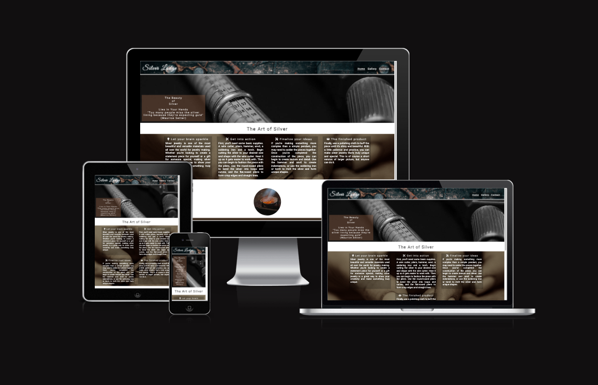
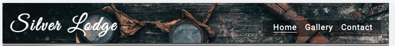
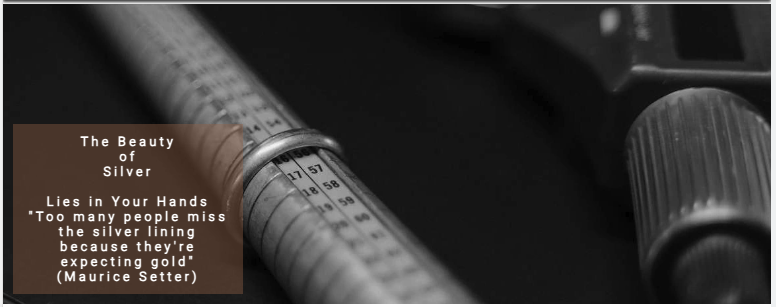
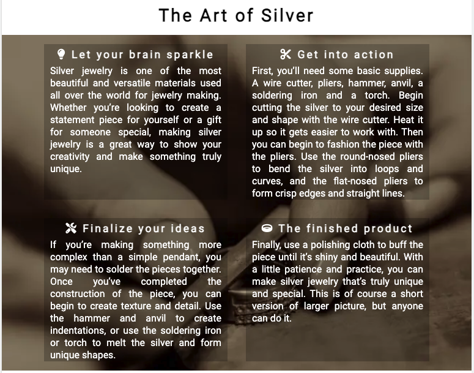
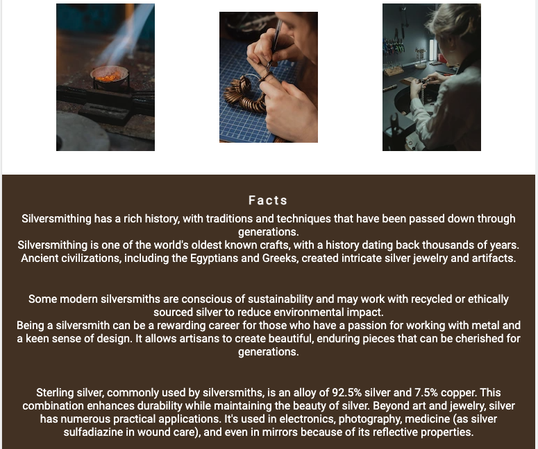
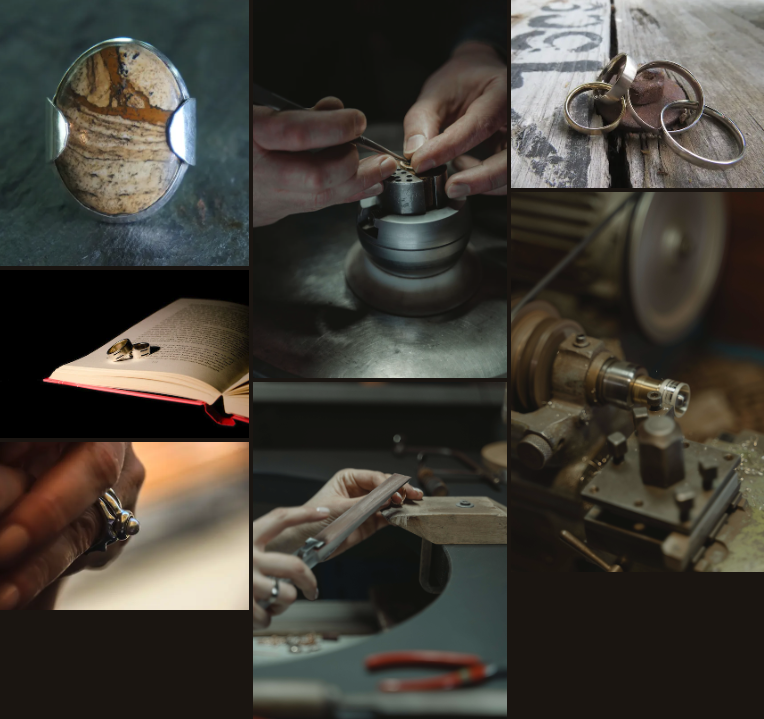
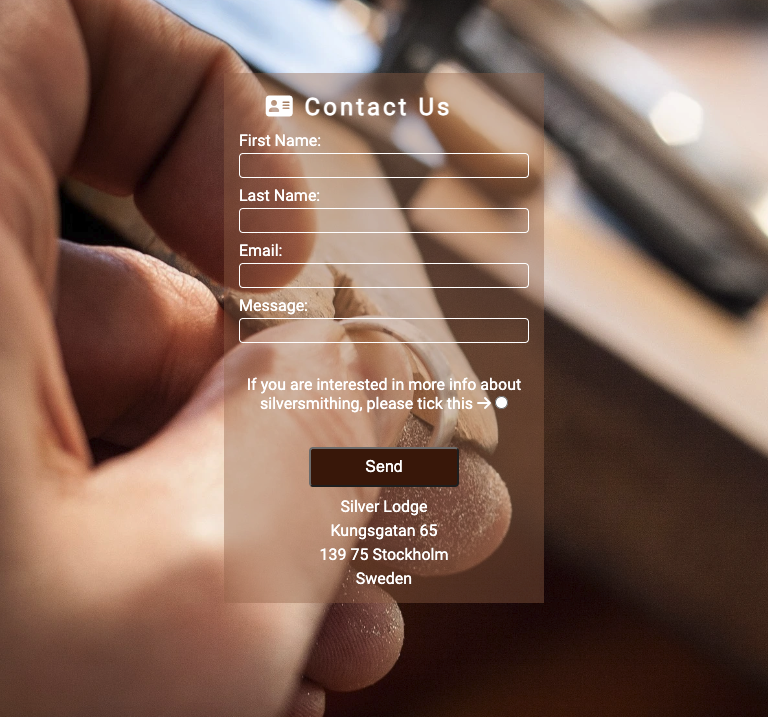
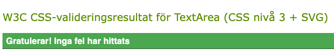

# Silver Lodge

## Introduction

Silver Lodge is a site that hopes to inspire others in the art of working with silver.
Anyone can become a silversmith. It just requires a genuine interest and a small investment towards tools.
A few ideas of somthing shiny can become reality if you follow a few simple steps,
and you can be on your way to making your own silver jewlery. Silver Lodge hopes to work as a guide towards your dreams and give you all the tools to make it happen.

Silversmithing is the art of working with silver to create exquisite jewelry, decorative items, cutlery, and more. As a silversmith, you have the opportunity to transform raw silver into unique and beautiful pieces through a combination of traditional techniques and modern technology. This README guide will provide you with an overview of the steps and considerations for becoming a silversmith

## Features

Silver Lodge consist of 3 pages: Home, Galler and a Contact page.
The Home Page serves as the welcoming gateway to the Silver Lodge website, providing visitors with an overview of the site's purpose.
The Gallery Page is the heart of the Silversmith website, where visitors can explore an extensive collection of stunning silverware pieces.
The Contact Page offers a convenient way for visitors to connect with the website administrators or the featured silversmiths.

### Existing Features

Navigaion Bar

- The Navigation Bar is fixed and will always be visable on all pages, the full responsive navigation bar includes links to the Home page, Gallery and Contact page and is identical in each page to allow for easy navigation.
- The user can easily navigate from page to page across all devices without having to revert back to the previous page using the ‘back’ button.</li>

Landing Page

- The landing part of the page consist of a photograph with text overlay that gives the user a understanding of what the page is about.</li>

The Art of Silver

This secition consist of four text boxes the process of creating a silver jewlery in a simplfied way.

- First box: General information about silver.
- Second: What is needed for the process of creating a piece of jewlery.
- Third: If the user wants to make a more complex piece this needs to be followed.
- Forth: The last step, to get a piece shiny is simple but very important.

Facts

- This section provides a few photos of silversmits working on certain items.
- It also contains a bit more of fun facts about silver and it's history and what other things silver is used for.

Footer

- The stylish footer contains links to our social media.
- A valuable asset to the user as it gives them an easy contact option via social media.
- All the links will open up in a new page.

Gallery

- The gallery will provide the user with beautiful images of different silverware and silversmiths in action.
- This is a valuable section to give the user and idea of what they can easily create themselves.

Contact Us page

- A user-friendly contact form allows visitors to enter their name and email address.
- This form simplifies the process of reaching out to site administrators and includes a radiobutton if the user is interested in more information via mail.
- They can also write a message where they can ask for more information or make an order.

Future Features

- More images to gallery.
- A more detailed section with pictures and information about the step to step process of making your own ring.
- A page where we introduce ourselfes and offer courses.

## Tecnologies Used

- [HTML5](https://en.wikipedia.org/wiki/HTML5)
- [CSS3](https://en.wikipedia.org/wiki/CSS)

## Frameworks, Libraries & Programs Used

- Github
  - Deployment of the website and storing the files online.
- Google Fonts
  - Import main font the website.
- Am I Responsive
  - Mockup picture for the README file.
- Codeanywhere
  - To write the code.
- Favico.io
- Font Awsome
  - For icons

## Testing

The Silver Lodge pages were all tested using the W3C Markup Validator and W3C CSS, to ensure there were no errors.

- [W3C Markup Validator](https://validator.w3.org/)
- [W3C CSS Validator](https://jigsaw.w3.org/css-validator/)

Validation Results

- W3C Markup Validator:
    - Index.html - No errors or warnings
    - Gallery.html - No errors but a warning: "Section lacks heading. Consider using h2-h6 elements to add identifying headings to all sections, or else use a div element instead for any cases where no heading is needed." Here i changed the "section" into a "div" instead and that took away the warning.
    - Contact.html - 4 errors. I had identical "id" in one of the "divs" and "input" which I quickly changed and the result was after that no errors.
- W3C CSS Validator: 
    - Style - 

Manual Testing

- The website was tested on Google Chrome, Firefox och Safari browsers.
- 
