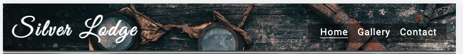
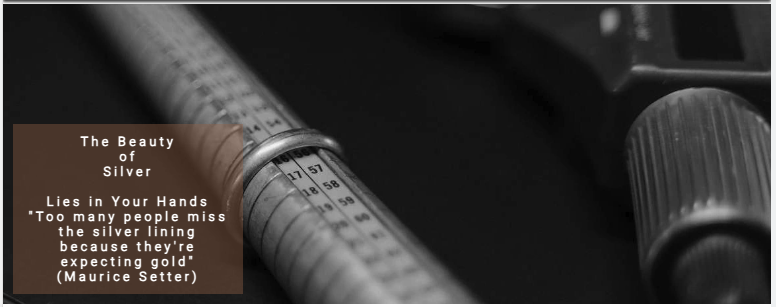

# Silver Lodge

## Introduction

Silver Lodge is a site that hopes to inspire others in the art of working with silver.
Anyone can become a silversmith. It just requires a genuine interest and a small investment towards tools.
A few ideas of somthing shiny can become reality if you follow a few simple steps,
and you can be on your way to making your own silver jewlery. Silver Lodge hopes to work as a guide towards your dreams and give you all the tools to make it happen.

Silversmithing is the art of working with silver to create exquisite jewelry, decorative items, cutlery, and more. As a silversmith, you have the opportunity to transform raw silver into unique and beautiful pieces through a combination of traditional techniques and modern technology. This README guide will provide you with an overview of the steps and considerations for becoming a silversmith

## Features

Silver Lodge consist of 3 pages: Home, Galler and a Contact page.
The Home Page serves as the welcoming gateway to the Silversmith website, providing visitors with an overview of the site's purpose and offerings.
The Gallery Page is the heart of the Silversmith website, where visitors can explore an extensive collection of stunning silverware pieces.
The Contact Page offers a convenient way for visitors to connect with the website administrators or the featured silversmiths.

### Existing Features

<ul>Navigaion Bar
<li>The Navigation Bar is fixed and will always be visable on all pages, the full responsive navigation bar includes links to the Home page, Gallery and Contact page and is identical in each page to allow for easy navigation.</li>
<li>The user can easily navigate from page to page across all devices without having to revert back to the previous page using the ‘back’ button.</li>

</ul>

<ul>Landing Page
<li>The landing part of the page consist of a photograph with text overlay that gives the user a understanding of what the page is about.</li>

</ul>
